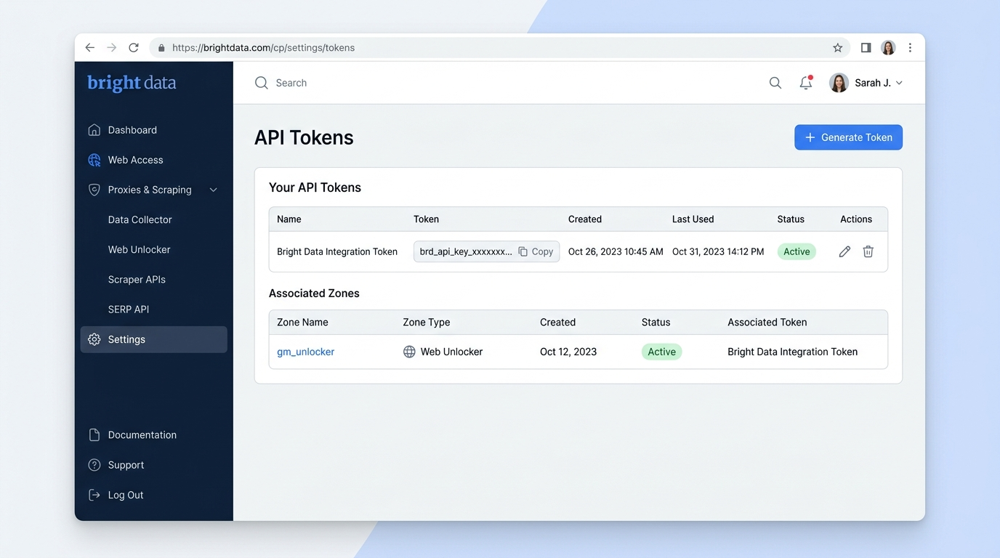
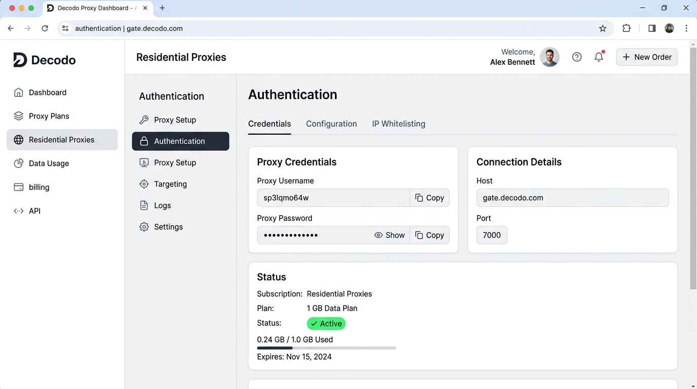
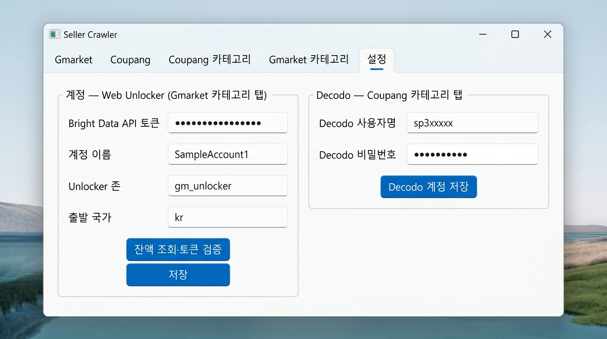

# 퀵스타트 가이드북: Gmarket, Coupang & AliExpress 외부 플랫폼 연동

본 가이드는 **[Gmarket 카테고리]**, **[Coupang 카테고리]**, **[Ali 카테고리]** 탭을 활성화하기 위해 필요한 외부 플랫폼(**Bright Data**, **Decodo**)의 계정 준비부터 키 발급, 프로그램 등록, 그리고 알리익스프레스의 0원 로컬 안전 수집 옵션까지 5단계 슬라이드로 안내합니다.

---

### [Slide 1] 왜 외부 플랫폼 연동이 필요한가?

#### 1. 목적 및 비즈니스 가치
* **이커머스 카테고리 전수 탐색 지원**: 단순 메인 상품 몇 개가 아닌, 수천·수만 개의 카테고리 하위 상품 목록을 끝까지 누락 없이 로드하기 위해 고성능 네트워크 통신 경로가 필요합니다.
* **차단 및 캡차 없는 무중단 수집**: 쇼핑몰의 자동 탐지 방어벽에 의해 접속이 끊기지 않도록, 각 사이트 특성에 최적화된 인증 회선을 사용합니다.
* **투명한 직접 정산**: 프로그램 개발사가 수수료를 덧붙이지 않고, 사용자가 직접 공식 플랫폼에서 발급받은 계정으로 사용한 만큼만(종량제) 실시간 결제·관리합니다.
* **비용 부담 없는 유연한 선택 (Ali 카테고리)**: 알리익스프레스는 대량 무인 수집을 위한 주거용 프록시 외에도, 프록시 계정 없이 PC 회선으로 무료 수집(0원)할 수 있는 로컬 안전 모드를 완벽 지원합니다.

#### 2. 탭별 매칭 플랫폼

| 수집 대상 탭 | 연동 외부 플랫폼 | 적용 솔루션 | 비용 정산 단위 |
| :--- | :--- | :--- | :--- |
| **Gmarket 카테고리** | **Bright Data** | Web Unlocker (존 이름: `gm_unlocker`) | 성공한 페이지 요청당 소액 차감 (건당 약 $0.0015~$0.003) |
| **Coupang 카테고리** | **Decodo** | 대한민국 주거용 고정 회선 (Residential Sticky) | 사용한 데이터 트래픽 용량 단위 차감 (1GB당 약 $4) |
| **Ali 카테고리** | **Decodo** (대량) 또는 **로컬 회선** (소량) | 주거용 회선 자동 순환 (25건 단위) 또는 PC 로컬 회선 (3.5초 안전 딜레이) | Decodo 사용 시 트래픽 단위 차감 / 로컬 회선 선택 시 **0원 (무료)** |

> **안내**: 등록된 인증 정보는 외부로 전송되지 않으며, 사용자 PC의 안전한 로컬 환경에만 암호화 보관됩니다.

---

### [Slide 2] Gmarket: Bright Data API 토큰 발급

지마켓 카테고리 수집을 위해 **Bright Data**의 **Web Unlocker** 존과 **API 토큰**을 발급받는 단계입니다.

#### 발급 4단계 절차
1. **플랫폼 접속 및 회원가입**:
   * [brightdata.com](https://brightdata.com)에 접속하여 로그인합니다.
   * `Billing` 메뉴에서 사용량 결제를 위한 수단(신용카드 등록 또는 소액 충전)을 완료합니다.
2. **Web Unlocker 존 생성**:
   * 좌측 메뉴 `Proxies & Scraping` → `Add` 클릭 후 **Web Unlocker**를 선택합니다.
   * 존 이름을 입력합니다. (기본 권장 이름: `gm_unlocker`)
3. **API 토큰 생성**:
   * 좌측 하단 `Settings` 아이콘 클릭 또는 [brightdata.com/cp/settings](https://brightdata.com/cp/settings)로 이동합니다.
   * `API Tokens` 메뉴에서 **[+ Generate Token]**을 클릭합니다.
4. **토큰 복사**:
   * 생성된 토큰(`brd_api_key_xxxxxxxx...`) 옆의 **[Copy]** 버튼을 눌러 복사해 둡니다.

> **팁**: API 토큰은 생성 직후 1회만 전체 내용이 표시되므로, 생성 즉시 안전한 메모장에 복사하거나 바로 프로그램에 입력해 주세요.

---

### [Slide 3] Coupang: Decodo 프록시 계정 발급

쿠팡의 정밀한 보안망을 통과하기 위해 **Decodo**의 **대한민국 주거용 고정 프록시 계정**을 발급받는 단계입니다.

#### 발급 3단계 절차
1. **플랫폼 접속 및 플랜 활성화**:
   * [decodo.com](https://decodo.com)에 접속하여 회원가입 및 로그인합니다.
   * `Proxy Plans`에서 **Residential Proxies**를 선택하고 필요 용량(최소 1GB 종량제)을 결제합니다.
2. **인증 메뉴(Authentication) 이동**:
   * 좌측 메뉴의 `Residential Proxies`를 클릭한 뒤 상단 탭에서 **[Authentication]**을 선택합니다.
3. **전용 인증 정보 복사**:
   * 화면 중앙 `Proxy Credentials`에 표시된 정보를 각각 복사합니다:
     * **Proxy Username**: 전용 사용자명 (예: `sp3lqmo64w`)
     * **Proxy Password**: 전용 비밀번호 (숨김 해제 후 복사)

> **중요**: **웹사이트 로그인 이메일/비밀번호가 아닙니다!** 반드시 대시보드의 `Authentication` 탭에 표기된 **프록시 전용 사용자명(Proxy Username)과 비밀번호**를 사용해야 합니다.

---

### [Slide 4] 프로그램 [설정] 탭 등록 및 즉시 검증

발급받은 Bright Data 토큰과 Decodo 계정을 수집기 프로그램에 등록하고 검증하는 단계입니다.

#### 1. Bright Data 등록 (Gmarket 카테고리)
1. 프로그램 상단 **[설정]** 탭을 클릭합니다.
2. 좌측 영역에 복사한 정보 입력:
   * **Bright Data API 토큰**: 복사한 토큰 붙여넣기
   * **Unlocker 존**: `gm_unlocker` 확인 (또는 본인이 만든 존 이름)
   * **출발 국가**: `kr` (한국 상품 목록 기준)
3. **[잔액 조회·토큰 검증]** 클릭:
   * "토큰 유효 — 잔액 $XX.XX" 메시지가 뜨며 정상 인증됨을 바로 확인합니다.
4. **[저장]** 버튼을 클릭하여 설정을 완료합니다.

#### 2. Decodo 등록 (Coupang 및 Ali 카테고리 공용)
1. 우측 `Decodo — Coupang 카테고리 탭` 영역에 입력:
   * **Decodo 사용자명**: 복사한 Username (예: `sp3xxxxxx`)
   * **Decodo 비밀번호**: 복사한 Password
2. **[Decodo 계정 저장]** 버튼 클릭:
   * "저장됨" 안내가 표시되면 쿠팡 카테고리 및 알리익스프레스 대량 무인 수집(25건 회선 순환) 준비가 완료됩니다.

---

### [Slide 5] 실전 수집 시작 및 운용 체크포인트

설정이 완료되면 원하는 쇼핑몰 카테고리 탭으로 이동하여 바로 수집을 시작할 수 있습니다.

#### 쇼핑몰별 수집 권장 요령
* **Gmarket 카테고리**:
  * 대분류, 중분류, 소분류 중 원하는 카테고리를 체크하거나 전체 선택합니다.
  * 페이지 딜레이는 기본값(8~12초)을 권장하며, 수집 도중 일시정지 및 이어하기가 가능합니다.
* **Coupang 카테고리**:
  * 안정적인 세션 유지를 위해 **한 번에 카테고리 1개씩 순차 진행**을 권장합니다.
  * 중단되더라도 [재개] 버튼을 누르면 마지막 수집 위치부터 이어서 상품을 수집합니다.
* **Ali 카테고리**:
  * 3,000개 이상의 카테고리 계층 트리에서 대분류/소분류를 선택하거나, '직접 URL 입력' 탭에서 특정 프로모션/검색 주소를 입력합니다.
  * **0원 알뜰 직접 수집**: Decodo 계정이 없어도 **[수집 시작]** 클릭 시 표시되는 안내 창에서 **[로컬 회선으로 안전 수집]**을 선택하면 비용 0원으로 3.5초 안전 딜레이를 적용하여 로컬 PC 회선으로 수집을 완주합니다.
  * **대량 무인 수집**: Decodo 계정 등록 시 25건 단위 자동 회선 순환으로 안정적인 대량 수집을 진행합니다.
  * **중단 복원력(Resume)**: 수집 중단 시 진행 상태가 `resume.sqlite3`에 실시간 보존되며, 재실행 시 **[이어서 수집]**을 통해 완료된 페이지는 건너뛰고 미완료 지점부터 빠르게 재개합니다.

#### 자가 진단 및 문제 해결 가이드
| 증상 | 주요 원인 | 즉각 조치 방법 |
| :--- | :--- | :--- |
| **인증 실패 (401/403)** | API 토큰 문자열 앞뒤 공백 또는 오타 | 토큰을 다시 복사하여 붙여넣은 뒤 [잔액 조회·토큰 검증] 클릭 |
| **프록시 인증 에러 (407)** | Decodo 사용자명/비밀번호 오입력 | 웹 로그인 비밀번호 대신 Decodo 대시보드의 Authentication 전용 키 재입력 |
| **요청 한도 초과 (429) / 잔액 소진** | 플랫폼 내 크레딧 잔액 부족 | 해당 플랫폼 대시보드(Billing)에서 크레딧 충전 또는 카드 한도 확인 |
